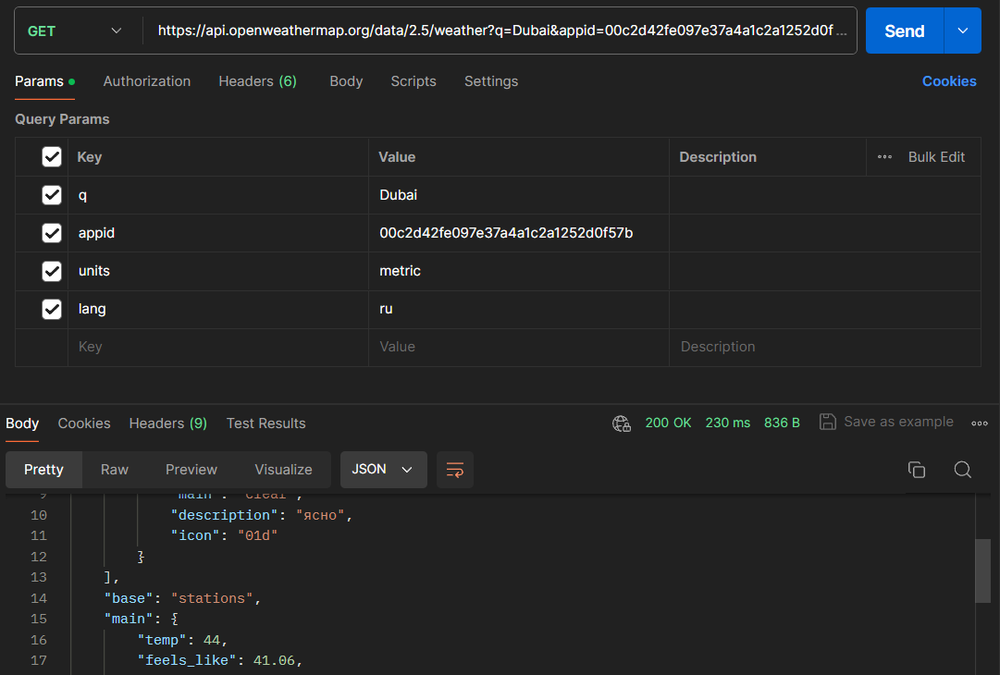
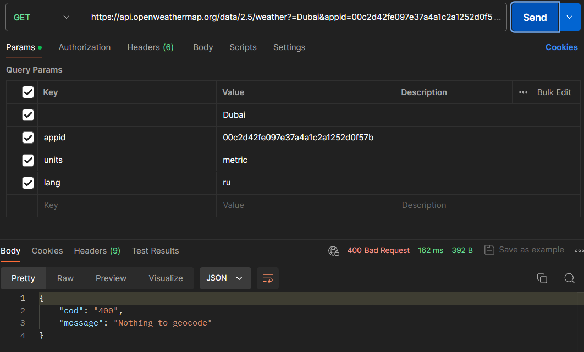
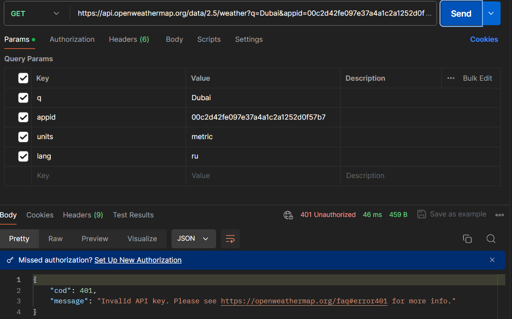
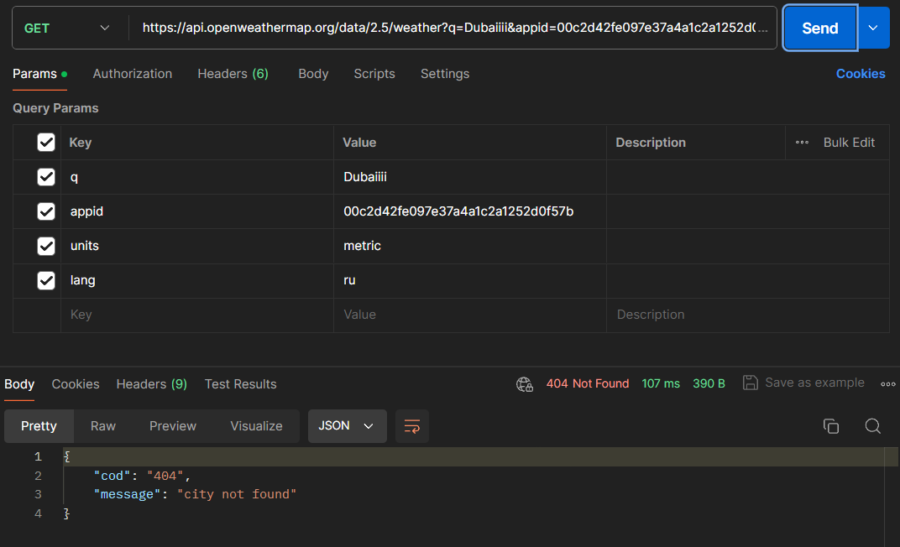
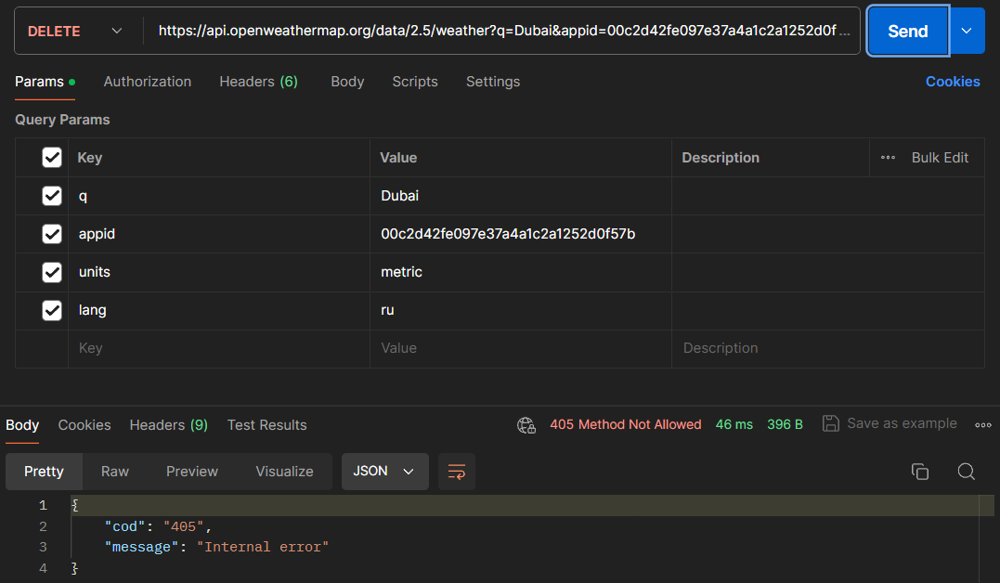

## 200 OK 

*Запрос был успешным, и сервер вернул запрашиваемые данные.*

## 400 Bad Request 

*Неверный синтаксис запроса(отсутствует обязательный параметр q).*

## 401 Unauthorized 

*Ошибка аутентификации(некорректный API ключ).*

## 404 Not Found 

*Ресурс не найден(Несуществующий город).*

## 405 Method Not Allowed 

*Метод запроса известен серверу, но не поддерживается целевым ресурсом.*
 